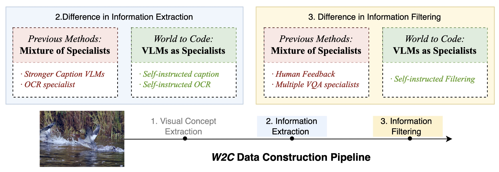
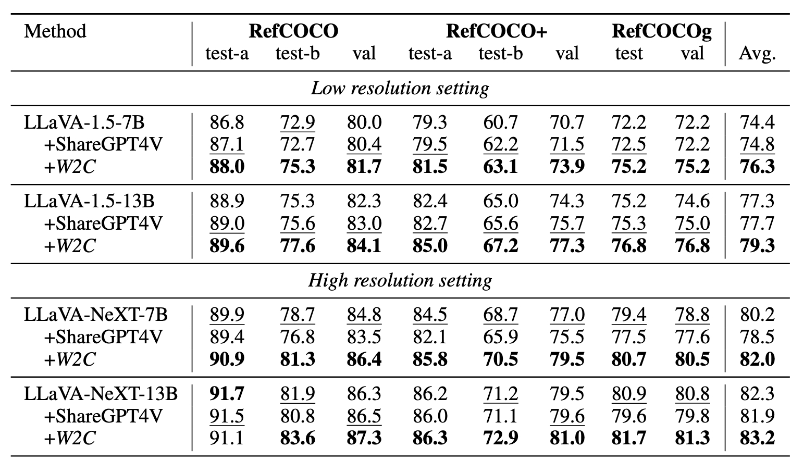

<div align="center">
<h1>World to Code: Multi-modal Data Generation via Self-Instructed Compositional Captioning and Filtering</h1>
<a href='https://github.com/tatsu-lab/stanford_alpaca/blob/main/LICENSE'></a>
<a href='https://arxiv.org/abs/2409.20424'></a>
  
Jiacong Wang<sup>1,2*</sup>, 
[Bohong Wu](https://scholar.google.com/citations?user=N6vypvkAAAAJ&hl=en)<sup>2*</sup>,
[Haiyong Jiang](https://people.ucas.ac.cn/~0054404)<sup>1</sup>, 
Xun Zhou<sup>2</sup>, 
[Xin Xiao](https://scholar.google.com/citations?user=CL-ZEdwAAAAJ&hl=zh-CN)<sup>2</sup>, 
[Haoyuan Guo](https://scholar.google.com/citations?hl=en&user=hql67boAAAAJ&view_op=list_works&sortby=pubdate) <sup>2</sup>
[Jun Xiao](https://scholar.google.com/citations?hl=zh-CN&user=9YbplfMAAAAJ)<sup>1</sup>, 

<sup>1</sup>School of Artificial Intelligence, University of Chinese Academy of Sciences, <sup>2</sup>ByteDance Inc

>**abstract:**
>Recent advances in Vision-Language Models (VLMs) and the scarcity of high-quality multi-modal alignment data have inspired numerous researches on synthetic VLM data generation. Challenging the conventional norm in VLM data construction, which uses a mixture of specialists in caption and OCR, or stronger VLM APIs and expensive human annotation, we propose to leverage the VLM itself for extracting cross-modal information of each via different
prompts and filter the generated outputs again by itself via a consistency filtering strategy. In this paper, we present World to Code (W2C), a meticulously curated multi-modal data construction pipeline that organizes the final generation output into a Python code format. Experiments have demonstrated the high quality of W2C by improving various existing visual question answering and visual grounding benchmarks across different VLMs. Further analysis also demonstrates that the new code
parsing ability of VLMs presents better cross-modal equivalence than the commonly used detail caption ability. 

</div>

<p align="center"></p> 


## Dataset: 
HuggingFace: stormthunder/world2code

Training Code:
You can execute demo bash scripts in this [directory](./run_scripts) to train LLaVA models or the repo https://github.com/foundation-multimodal-models/CAL.


## News and Updates


## Results
We provide results comparision for LLaVA-NEXT here. 
<p align="center"></p>
<p align="center"></p>


### 1. Customize base settings
Before training, **you need to customize some settings in the following table**. Otherwise, the code will use the default paths specified in [run.sh](LLaVA/scripts/general/run.sh). **When using multiple data sources, simply concatenate their paths with a space**.


| Setting            | Usage                                         |
|--------------------|-----------------------------------------------|
| `base_dir`         | Path saving root directory                    |
| `exp_name`         | Experiment name, associated with the saving path |
| `pretrain_json`    | Pretrain JSON data                            |
| `pretrain_imagedir`| Pretrain data image directory                 |
| `finetune_json`    | Finetune JSON data                            |
| `finetune_imagedir`| Finetune data image directory                 |


## Acknowledgement

- [LLaVA](https://github.com/haotian-liu/LLaVA): the codebase we built upon.
- [lmms-eval](https://github.com/EvolvingLMMs-Lab/lmms-eval): the codebase we evaluate our model.

Thanks a lot for their great works.

## Citation
```bibtex
@inproceedings{
anonymous2024world,
title={World to Code: Multi-modal Data Generation via Self-Instructed Compositional Captioning and Filtering},
author={Anonymous},
booktitle={The 2024 Conference on Empirical Methods in Natural Language Processing},
year={2024},
url={https://openreview.net/forum?id=lEoTofDOZx}
}
```


